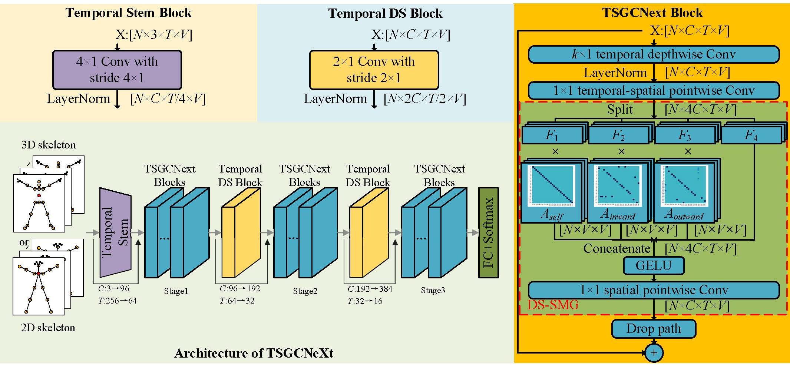

# TSGCNEXT 


## Architecture of TSGCNeXt

# Prerequisites

- Python >= 3.6
- PyTorch >= 1.1.0
- PyYAML, tqdm, tensorboardX

- We provide the dependency file of our experimental environment, you can install all dependencies by creating a new anaconda virtual environment and running `pip install -r requirements.txt `
- Run `pip install -e torchlight` 
- pip install timm==0.3.2 tensorboardX six

# Data Preparation

### Download datasets.

#### There are 3 datasets to download:

- NTU RGB+D 60 Skeleton
- NTU RGB+D 120 Skeleton
- NW-UCLA

#### NTU RGB+D 60 and 120

1. Request dataset here: http://rose1.ntu.edu.sg/Datasets/actionRecognition.asp
2. Download the skeleton-only datasets:
   1. `nturgbd_skeletons_s001_to_s017.zip` (NTU RGB+D 60)
   2. `nturgbd_skeletons_s018_to_s032.zip` (NTU RGB+D 120)
   3. Extract above files to `./data/nturgbd_raw`


### Data Processing

#### Directory Structure

Put downloaded data into the following directory structure:

```
- data/
  - NW-UCLA/
    - all_sqe
      ... # raw data of NW-UCLA
  - ntu/
  - ntu120/
  - nturgbd_raw/
    - nturgb+d_skeletons/     # from `nturgbd_skeletons_s001_to_s017.zip`
      ...
    - nturgb+d_skeletons120/  # from `nturgbd_skeletons_s018_to_s032.zip`
      ...
```

#### Generating Data

- Generate NTU RGB+D 60 or NTU RGB+D 120 dataset:

```
 cd ./data/ntu # or cd ./data/ntu120
 # Get skeleton of each performer
 python get_raw_skes_data.py
 # Remove the bad skeleton 
 python get_raw_denoised_data.py
 # Transform the skeleton to the center of the first frame
 python seq_transformation.py
```
## Training
- Run the following command:

```
CUDA_VISIBLE_DEVICES=0,1 python -m torch.distributed.launch --nproc_per_node=2 main_modern.py --config <work_dir>/config.yaml --batch_size 32 --lr 4e-3 --update_freq 2 --model_ema true --model_ema_eval true --dist_url tcp://127.0.0.3:132
```


## Testing

- To test the trained models saved in <work_dir>, run the following command:

```
python get_info.py --config <work_dir>/config.yaml --work-dir <work_dir> --phase test --save-score True --weights <work_dir>/xxx.pt --device 0
```

- To ensemble the results of different modalities, run 
```
python ensemble.py --dataset ntu120/xset \
--joint-dir work_dir/ntu120/xset252/TSGCNext3_jointmodern \
--bone-dir work_dir/ntu120/xset252/TSGCNext3_bonemodern \
--joint-motion-dir work_dir/ntu120/xset432/TSGCNext3_jointmodern \
--bone-motion-dir work_dir/ntu120/xset432/TSGCNext3_bonemodern \
--ema True
```

### Pretrained Models

- Download pretrained models for producing the final results on NTU RGB+D 60&120 [[Google Drive]](https://drive.google.com/file/d/1FNJUkvGcmEvyqP93SsIV-PnppA4LBdyA/view?usp=share_link).
- Put files to <work_dir> and run **Testing** command to produce the final result.

### Cite
This code is for paper "TSGCNeXt: Dynamic-Static Multi-Graph Convolution for Efficient Skeleton-Based Action Recognition with Long-term Learning Potential".

You can get paper here: https://arxiv.org/abs/2304.11631

PS:这个工作拖的实在是太久了，结果很棒，但是咱写论文水平有点感人，哈哈，先开源了，大家先看看，希望能对之后的工作有所帮助。

冲击ICCV应该失败了，再挣扎rebuttal一下，还是水平不够呀，继续加油，新版的论文吸取意见后在近期放出！

先把完整版本开放给大家吧！训练的策略跟之前的工作确实有些不一样，不过大家可以借鉴一下，应该能给这个任务带来很大的提升！

如果您有疑问的话也可以加我的微信一起探讨，一起学习！


### 正在工作

acceleration strategy 已更新

1 在新的大规模训练集kinect上进行训练中，敬请期待新代码和模型权重

目前进展，epoch200，openpose标记设置下，4:3:2配置下单流ACC1 34.592848143593955% ACC5: 57.10749793153841%，2:5:2配置未训练完成但是精度更好，ACC1 35.43645300935509%,  ACC5 58.26429732194162%

2 TSGCNEXTv2有了最新进展，力图用更少的流获得更好的性能

目前进展，新架构验证代码已完成，但是创新点不太够，正在引入新的学习机制

3 在多流融合中测试6流或者8流的融合结果，以探索精度极限

4 在小规模数据集ucla上开展进一步的参数调整

5 新版论文撰写完成，近期更新
